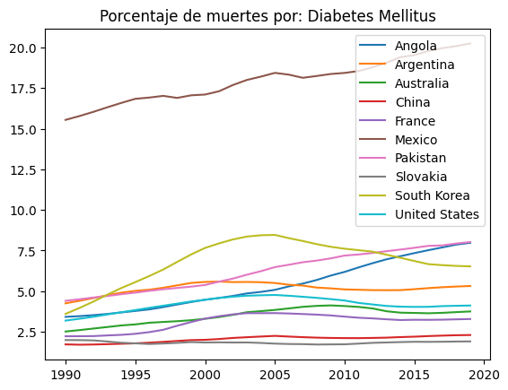
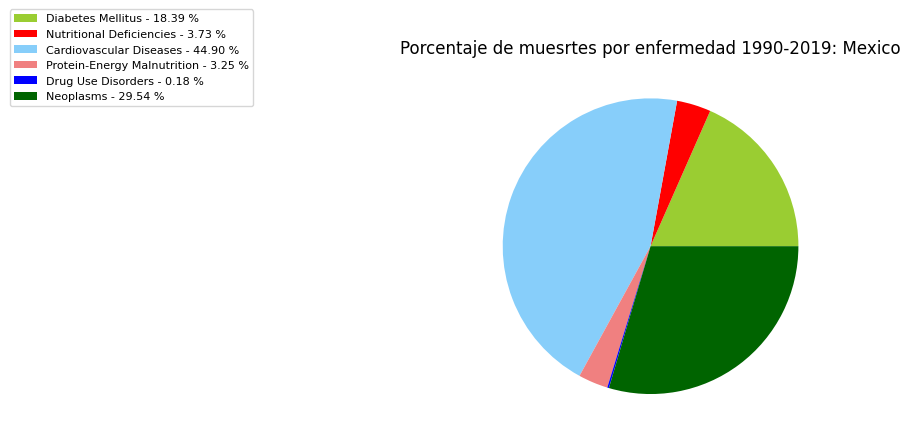

# PROYECTO FINAL

```python
import pandas as pd
import matplotlib.pyplot as plt
#Leemos los archivos iniciales

filesPath="C:\\Users\\carlo\\OneDrive\\Documentos\\Escuela\\DAI\\ProyectoFinalDai\\"
causesRaw = pd.read_csv(filesPath+"cause_of_deaths.csv", encoding="utf-8").rename({"Country/Territory": "Entity"}, axis=1).sort_values(by=["Entity", "Year"])
populationRaw = pd.read_csv(filesPath+"population.csv", encoding="utf-8").sort_values(by=["Entity", "Year"])
countryList = [
    "China",
    "United States",
    "Mexico",
    "Angola",
    "Argentina",
    "Pakistan",
    "Australia",
    "South Korea",
    "Slovakia",
    "France"
]

colsList = [
    "Diabetes Mellitus",
    "Nutritional Deficiencies",
    "Cardiovascular Diseases",
    "Protein-Energy Malnutrition",
    "Drug Use Disorders",
    "Neoplasms"
]
# Delimitamos las tablas según los países y enfermedades asignadas

population=pd.DataFrame()
for entity in countryList:
    population = pd.concat([population, populationRaw[populationRaw["Entity"]==entity]])

causes=pd.DataFrame()
ids=["Entity", "Code", "Year"]
for entity in countryList:
    causes = pd.concat([causes, causesRaw[causesRaw["Entity"]==entity].loc[:,ids+colsList]])
```
## PROBLEMA 1

```python
print("\n----------     1     -----------\n")
#Copiamos la tabla de las causas

percentage = causes.copy()
#Dividimos la cantidad de muertes entre las muertes totales y multpilicamos por cien para calcular el porcentaje

percentage.iloc[:, 3:] = percentage.iloc[:,3:].div(causes.sum(axis=1, numeric_only=True), axis="index")*100
print("Tabla de porcentajes: \n", percentage)
print(" ")
```

    
    ----------     1     -----------
    
    Tabla de porcentajes: 
           Entity Code  Year  Diabetes Mellitus  Nutritional Deficiencies  \
    1120   China  CHN  1990           1.724523                  1.037730   
    1121   China  CHN  1991           1.703754                  1.025955   
    1122   China  CHN  1992           1.716309                  0.905743   
    1123   China  CHN  1993           1.737998                  0.828250   
    1124   China  CHN  1994           1.762449                  0.764808   
    ...      ...  ...   ...                ...                       ...   
    1915  France  FRA  2015           3.239003                  1.122832   
    1916  France  FRA  2016           3.234999                  1.150057   
    1917  France  FRA  2017           3.244750                  1.174768   
    1918  France  FRA  2018           3.266243                  1.200740   
    1919  France  FRA  2019           3.285376                  1.214506   
    
          Cardiovascular Diseases  Protein-Energy Malnutrition  \
    1120                59.641681                     0.984559   
    1121                59.368049                     0.976018   
    1122                59.346811                     0.858834   
    1123                59.164685                     0.785552   
    1124                58.828531                     0.724104   
    ...                       ...                          ...   
    1915                41.632506                     1.084067   
    1916                41.876640                     1.111035   
    1917                42.158431                     1.135368   
    1918                42.517377                     1.161599   
    1919                42.714501                     1.175254   
    
          Drug Use Disorders  Neoplasms  
    1120            0.666567  35.895976  
    1121            0.744413  36.133686  
    1122            0.793539  36.331260  
    1123            0.818456  36.618251  
    1124            0.865928  37.007721  
    ...                  ...        ...  
    1915            0.467114  51.900485  
    1916            0.458649  51.614614  
    1917            0.459936  51.286134  
    1918            0.467056  50.856883  
    1919            0.471795  50.620594  
    
    [300 rows x 9 columns]
     

## PROBLEMA 2

```python
print("\n----------     2     -----------\n")
# Creamos un DataFrame con los años, sin repeticiones, como columnas

growth = pd.DataFrame(index=pd.unique(population["Year"]))
# Obtenemos la población por cada país

for entity, df in population.groupby("Entity"):
    growth[entity] = df["Population (historical estimates)"].values
#Calculamos los porcentajes de crecimiento en las columnas de los países

growth=growth.pct_change()*100
#Graficamos

growth.plot(title="Porcentaje de crecimiento por país")
#Cerramos gráfica

plt.show()
plt.close()
```

    
    ----------     2     -----------
    
    


    

    

## PROBLEMA 3

```python
print("\n----------     3     -----------\n")
#Iteramos sobre cada enfermedad asignada

for dis in colsList:
    #Creamos un Dataframe para guardar la info y graficat
    dfDis = pd.DataFrame(index=pd.unique(percentage["Year"]))
    #Analizaremos esta enfermedad sobre cada país requerido
    for entity, df in percentage.groupby("Entity"):
        #Obtenemos los valores de la enfemedad que queremos
        dfDis[entity] = df.loc[:, dis].values
    #Graficamos
    #El contador i nos sirve para saber en qué renglón y columna poner la subgráfica
    ax = dfDis.plot(title="Porcentaje de muertes por: "+dis)
    #Cerramos gráfica
    plt.show()
    plt.close()
#Obtenemos los valores de todos los países
#Encontramos el máximo para cada enfermedad y su id

maxes = percentage.idxmax(numeric_only=True)[1:]
#Actualizamos, le damos a max como valores el nombre de los países y como índice el nombre de la enfermedad

maxes.update(pd.Series(percentage.loc[maxes, 'Entity'].values, index=maxes.index))
mins = percentage.idxmax(numeric_only=True)[1:]
mins.update(pd.Series(percentage.loc[percentage.idxmin(numeric_only=True)[1:], 'Entity'].values, index=mins.index))
print("País con porcentajes máximos: \n", maxes)
print(" ")
print("País con porcentajes mínimos: \n", mins)
print(" ")
#Calculamos el promedio de las columnas de las enfermedades

print("Promedios: \n", percentage.iloc[:,3:].mean())
print(" ")
```

    
    ----------     3     -----------
    
    


    

    


    

    


    

    


    

    


    

    


    

    


    País con porcentajes máximos: 
     Diabetes Mellitus                     Mexico
    Nutritional Deficiencies              Angola
    Cardiovascular Diseases             Slovakia
    Protein-Energy Malnutrition           Angola
    Drug Use Disorders             United States
    Neoplasms                        South Korea
    dtype: object
     
    País con porcentajes mínimos: 
     Diabetes Mellitus                  China
    Nutritional Deficiencies        Slovakia
    Cardiovascular Diseases           Angola
    Protein-Energy Malnutrition     Slovakia
    Drug Use Disorders             Argentina
    Neoplasms                         Angola
    dtype: object
     
    Promedios: 
     Diabetes Mellitus               5.621399
    Nutritional Deficiencies        2.790819
    Cardiovascular Diseases        51.589167
    Protein-Energy Malnutrition     2.546225
    Drug Use Disorders              0.378318
    Neoplasms                      35.492814
    dtype: float64
     
    
## PROBLEMA 4

```python
print("\n----------     4     -----------\n")
#Creamos un nuevo dataframe, guardamos datos de poblacion y solo los valores de entidad, código y año de tabla de causas
#Hacemos este inner join para evitar tener datos incompletos que afecten el resultado

populDeaths = pd.merge(population, causes.iloc[:,[0,1,2]], how="inner", on=["Entity", "Code", "Year"])
#Obtenemos la suma de la cantidad de muertes por año por país

populDeaths["Total Deaths"] = causes.iloc[:,3:].sum(axis=1).values
#Calculamos el porcentaje de estas muertes respecto al estimado de población

populDeaths["Death Percentage"] = populDeaths["Total Deaths"]/populDeaths["Population (historical estimates)"]*100
#Creamos un data frame para graficar con el año como índice

deathPercentages=pd.DataFrame(index=pd.unique(populDeaths["Year"]))
#Iteramos sobre cada país asignado

for entity, df in populDeaths.groupby("Entity"):
    #Obtenemos los valores del porcentaje de muertes y lo guardamos en una columna del data frame previamente definido
    deathPercentages[entity]=df["Death Percentage"].values
    print(df)
#Graficamos la colección de todos los países

deathPercentages.plot(title="Porcentaje de personas fallecidas")
#Cerramos gráfica

plt.show()
plt.close()
#Obtenemos posición de valores

idMax=populDeaths["Death Percentage"].idxmax()
idMin=populDeaths["Death Percentage"].idxmin()
#Obtenemos valores desde la posición

print("País con mayor porcentaje de muertes: ", populDeaths.iloc[idMax,0])
print("País con menor porcentaje de muertes: ", populDeaths.iloc[idMin,0])
```

    
    ----------     4     -----------
    
         Entity Code  Year  Population (historical estimates)  Total Deaths  \
    90   Angola  AGO  1990                           11828643         42466   
    91   Angola  AGO  1991                           12228698         42868   
    92   Angola  AGO  1992                           12632509         43334   
    93   Angola  AGO  1993                           13038277         44030   
    94   Angola  AGO  1994                           13462032         44325   
    95   Angola  AGO  1995                           13912258         44073   
    96   Angola  AGO  1996                           14383352         43105   
    97   Angola  AGO  1997                           14871148         42482   
    98   Angola  AGO  1998                           15366866         42699   
    99   Angola  AGO  1999                           15870759         42725   
    100  Angola  AGO  2000                           16394067         42547   
    101  Angola  AGO  2001                           16941584         42197   
    102  Angola  AGO  2002                           17516140         41620   
    103  Angola  AGO  2003                           18124346         41836   
    104  Angola  AGO  2004                           18771128         43191   
    105  Angola  AGO  2005                           19450962         42708   
    106  Angola  AGO  2006                           20162338         42655   
    107  Angola  AGO  2007                           20909692         42390   
    108  Angola  AGO  2008                           21691524         42511   
    109  Angola  AGO  2009                           22507674         42471   
    110  Angola  AGO  2010                           23364196         42915   
    111  Angola  AGO  2011                           24259120         43091   
    112  Angola  AGO  2012                           25188298         43473   
    113  Angola  AGO  2013                           26147012         43522   
    114  Angola  AGO  2014                           27128340         43123   
    115  Angola  AGO  2015                           28127724         43900   
    116  Angola  AGO  2016                           29154742         44605   
    117  Angola  AGO  2017                           30208634         45562   
    118  Angola  AGO  2018                           31273538         46899   
    119  Angola  AGO  2019                           32353592         48549   
    
         Death Percentage  
    90           0.359010  
    91           0.350552  
    92           0.343036  
    93           0.337698  
    94           0.329259  
    95           0.316793  
    96           0.299687  
    97           0.285667  
    98           0.277864  
    99           0.269206  
    100          0.259527  
    101          0.249074  
    102          0.237609  
    103          0.230828  
    104          0.230093  
    105          0.219568  
    106          0.211558  
    107          0.202729  
    108          0.195980  
    109          0.188696  
    110          0.183678  
    111          0.177628  
    112          0.172592  
    113          0.166451  
    114          0.158959  
    115          0.156074  
    116          0.152994  
    117          0.150824  
    118          0.149964  
    119          0.150058  
            Entity Code  Year  Population (historical estimates)  Total Deaths  \
    120  Argentina  ARG  1990                           32637658        164900   
    121  Argentina  ARG  1991                           33105766        164699   
    122  Argentina  ARG  1992                           33568280        167249   
    123  Argentina  ARG  1993                           34027240        167003   
    124  Argentina  ARG  1994                           34488696        164964   
    125  Argentina  ARG  1995                           34946116        166986   
    126  Argentina  ARG  1996                           35389360        168830   
    127  Argentina  ARG  1997                           35815968        171036   
    128  Argentina  ARG  1998                           36233196        174496   
    129  Argentina  ARG  1999                           36653032        176676   
    130  Argentina  ARG  2000                           37070772        172524   
    131  Argentina  ARG  2001                           37480492        173427   
    132  Argentina  ARG  2002                           37885024        176416   
    133  Argentina  ARG  2003                           38278164        178338   
    134  Argentina  ARG  2004                           38668796        175189   
    135  Argentina  ARG  2005                           39070504        172965   
    136  Argentina  ARG  2006                           39476856        173598   
    137  Argentina  ARG  2007                           39876116        177710   
    138  Argentina  ARG  2008                           40273768        174089   
    139  Argentina  ARG  2009                           40684344        174938   
    140  Argentina  ARG  2010                           41100124        178138   
    141  Argentina  ARG  2011                           41520736        179640   
    142  Argentina  ARG  2012                           41952364        180410   
    143  Argentina  ARG  2013                           42388268        181741   
    144  Argentina  ARG  2014                           42824064        182301   
    145  Argentina  ARG  2015                           43257064        186528   
    146  Argentina  ARG  2016                           43668236        194499   
    147  Argentina  ARG  2017                           44054616        198272   
    148  Argentina  ARG  2018                           44413592        197602   
    149  Argentina  ARG  2019                           44745516        200367   
    
         Death Percentage  
    120          0.505245  
    121          0.497493  
    122          0.498235  
    123          0.490792  
    124          0.478313  
    125          0.477839  
    126          0.477064  
    127          0.477541  
    128          0.481592  
    129          0.482023  
    130          0.465391  
    131          0.462713  
    132          0.465662  
    133          0.465900  
    134          0.453050  
    135          0.442700  
    136          0.439746  
    137          0.445655  
    138          0.432264  
    139          0.429988  
    140          0.433424  
    141          0.432651  
    142          0.430035  
    143          0.428753  
    144          0.425698  
    145          0.431208  
    146          0.445402  
    147          0.450060  
    148          0.444913  
    149          0.447792  
            Entity Code  Year  Population (historical estimates)  Total Deaths  \
    180  Australia  AUS  1990                           17048002         85411   
    181  Australia  AUS  1991                           17271092         85320   
    182  Australia  AUS  1992                           17462500         86832   
    183  Australia  AUS  1993                           17631514         87373   
    184  Australia  AUS  1994                           17805506         89348   
    185  Australia  AUS  1995                           18003002         89583   
    186  Australia  AUS  1996                           18211850         90623   
    187  Australia  AUS  1997                           18410254         90460   
    188  Australia  AUS  1998                           18601666         90122   
    189  Australia  AUS  1999                           18800892         89808   
    190  Australia  AUS  2000                           19017968         89843   
    191  Australia  AUS  2001                           19248146         90020   
    192  Australia  AUS  2002                           19475842         90933   
    193  Australia  AUS  2003                           19699004         90283   
    194  Australia  AUS  2004                           19925060         90148   
    195  Australia  AUS  2005                           20171732         89884   
    196  Australia  AUS  2006                           20467032         90657   
    197  Australia  AUS  2007                           20830832         92675   
    198  Australia  AUS  2008                           21247876         94077   
    199  Australia  AUS  2009                           21660898         93621   
    200  Australia  AUS  2010                           22019166         93624   
    201  Australia  AUS  2011                           22357032         94779   
    202  Australia  AUS  2012                           22729272         94619   
    203  Australia  AUS  2013                           23111788         95161   
    204  Australia  AUS  2014                           23469578         97360   
    205  Australia  AUS  2015                           23820240         99651   
    206  Australia  AUS  2016                           24195706        100444   
    207  Australia  AUS  2017                           24590336        103356   
    208  Australia  AUS  2018                           24979228        107709   
    209  Australia  AUS  2019                           25357168        110982   
    
         Death Percentage  
    180          0.501003  
    181          0.494005  
    182          0.497248  
    183          0.495550  
    184          0.501800  
    185          0.497600  
    186          0.497605  
    187          0.491357  
    188          0.484483  
    189          0.477679  
    190          0.472411  
    191          0.467681  
    192          0.466902  
    193          0.458313  
    194          0.452435  
    195          0.445594  
    196          0.442942  
    197          0.444893  
    198          0.442760  
    199          0.432212  
    200          0.425193  
    201          0.423934  
    202          0.416287  
    203          0.411742  
    204          0.414835  
    205          0.418346  
    206          0.415132  
    207          0.420311  
    208          0.431194  
    209          0.437675  
       Entity Code  Year  Population (historical estimates)  Total Deaths  \
    0   China  CHN  1990                         1153704192       4062265   
    1   China  CHN  1991                         1170626176       4135226   
    2   China  CHN  1992                         1183813376       4191251   
    3   China  CHN  1993                         1195855616       4255780   
    4   China  CHN  1994                         1207286656       4289932   
    5   China  CHN  1995                         1218144384       4345019   
    6   China  CHN  1996                         1228298880       4424972   
    7   China  CHN  1997                         1237801472       4486165   
    8   China  CHN  1998                         1246836096       4574624   
    9   China  CHN  1999                         1255433216       4730642   
    10  China  CHN  2000                         1264099072       4943983   
    11  China  CHN  2001                         1272739584       5090180   
    12  China  CHN  2002                         1280926080       5250826   
    13  China  CHN  2003                         1288873344       5413480   
    14  China  CHN  2004                         1296816768       5614202   
    15  China  CHN  2005                         1304887552       5699389   
    16  China  CHN  2006                         1313086592       5646656   
    17  China  CHN  2007                         1321513216       5692351   
    18  China  CHN  2008                         1330167168       5845379   
    19  China  CHN  2009                         1339125632       6041851   
    20  China  CHN  2010                         1348191360       6259108   
    21  China  CHN  2011                         1357095424       6399224   
    22  China  CHN  2012                         1366560768       6459769   
    23  China  CHN  2013                         1376100352       6558228   
    24  China  CHN  2014                         1385189632       6677003   
    25  China  CHN  2015                         1393715456       6778493   
    26  China  CHN  2016                         1401889664       6963452   
    27  China  CHN  2017                         1410275968       7121928   
    28  China  CHN  2018                         1417069440       7287367   
    29  China  CHN  2019                         1421864064       7515123   
    
        Death Percentage  
    0           0.352106  
    1           0.353249  
    2           0.354047  
    3           0.355877  
    4           0.355337  
    5           0.356692  
    6           0.360252  
    7           0.362430  
    8           0.366899  
    9           0.376814  
    10          0.391107  
    11          0.399939  
    12          0.409924  
    13          0.420016  
    14          0.432922  
    15          0.436772  
    16          0.430029  
    17          0.430745  
    18          0.439447  
    19          0.451179  
    20          0.464260  
    21          0.471538  
    22          0.472703  
    23          0.476581  
    24          0.482028  
    25          0.486361  
    26          0.496719  
    27          0.505002  
    28          0.514256  
    29          0.528540  
         Entity Code  Year  Population (historical estimates)  Total Deaths  \
    270  France  FRA  1990                           56412896        332751   
    271  France  FRA  1991                           56645216        331721   
    272  France  FRA  1992                           56864048        331198   
    273  France  FRA  1993                           57053728        333171   
    274  France  FRA  1994                           57230064        331269   
    275  France  FRA  1995                           57420356        334028   
    276  France  FRA  1996                           57623180        336727   
    277  France  FRA  1997                           57839364        335287   
    278  France  FRA  1998                           58080344        339605   
    279  France  FRA  1999                           58352208        340996   
    280  France  FRA  2000                           58665456        339713   
    281  France  FRA  2001                           59014776        341061   
    282  France  FRA  2002                           59372784        344255   
    283  France  FRA  2003                           59728260        345466   
    284  France  FRA  2004                           60108436        334917   
    285  France  FRA  2005                           60510080        335393   
    286  France  FRA  2006                           60919152        334707   
    287  France  FRA  2007                           61329380        336135   
    288  France  FRA  2008                           61721004        341129   
    289  France  FRA  2009                           62093300        344953   
    290  France  FRA  2010                           62444568        346118   
    291  France  FRA  2011                           62775272        348280   
    292  France  FRA  2012                           63071412        352943   
    293  France  FRA  2013                           63335180        353231   
    294  France  FRA  2014                           63588496        351765   
    295  France  FRA  2015                           63809768        361708   
    296  France  FRA  2016                           63989320        361879   
    297  France  FRA  2017                           64144092        371078   
    298  France  FRA  2018                           64277812        378664   
    299  France  FRA  2019                           64399760        387769   
    
         Death Percentage  
    270          0.589849  
    271          0.585612  
    272          0.582438  
    273          0.583960  
    274          0.578837  
    275          0.581724  
    276          0.584360  
    277          0.579687  
    278          0.584716  
    279          0.584375  
    280          0.579068  
    281          0.577925  
    282          0.579820  
    283          0.578396  
    284          0.557188  
    285          0.554276  
    286          0.549428  
    287          0.548082  
    288          0.552695  
    289          0.555540  
    290          0.554280  
    291          0.554804  
    292          0.559593  
    293          0.557717  
    294          0.553190  
    295          0.566854  
    296          0.565530  
    297          0.578507  
    298          0.589105  
    299          0.602128  
        Entity Code  Year  Population (historical estimates)  Total Deaths  \
    60  Mexico  MEX  1990                           81720424        170260   
    61  Mexico  MEX  1991                           83351600        172571   
    62  Mexico  MEX  1992                           84993160        176634   
    63  Mexico  MEX  1993                           86648440        181597   
    64  Mexico  MEX  1994                           88314416        185729   
    65  Mexico  MEX  1995                           89969568        192172   
    66  Mexico  MEX  1996                           91586560        195964   
    67  Mexico  MEX  1997                           93183088        199463   
    68  Mexico  MEX  1998                           94767288        200686   
    69  Mexico  MEX  1999                           96334808        200619   
    70  Mexico  MEX  2000                           97873448        199907   
    71  Mexico  MEX  2001                           99394288        202783   
    72  Mexico  MEX  2002                          100917080        210989   
    73  Mexico  MEX  2003                          102429344        218424   
    74  Mexico  MEX  2004                          103945816        220154   
    75  Mexico  MEX  2005                          105442400        228636   
    76  Mexico  MEX  2006                          106886792        229498   
    77  Mexico  MEX  2007                          108302976        233183   
    78  Mexico  MEX  2008                          109684496        247201   
    79  Mexico  MEX  2009                          111049424        260051   
    80  Mexico  MEX  2010                          112532400        263547   
    81  Mexico  MEX  2011                          114150480        267552   
    82  Mexico  MEX  2012                          115755912        276682   
    83  Mexico  MEX  2013                          117290680        295557   
    84  Mexico  MEX  2014                          118755888        306676   
    85  Mexico  MEX  2015                          120149896        314057   
    86  Mexico  MEX  2016                          121519224        323888   
    87  Mexico  MEX  2017                          122839256        340279   
    88  Mexico  MEX  2018                          124013864        348770   
    89  Mexico  MEX  2019                          125085312        362693   
    
        Death Percentage  
    60          0.208344  
    61          0.207040  
    62          0.207821  
    63          0.209579  
    64          0.210304  
    65          0.213597  
    66          0.213966  
    67          0.214055  
    68          0.211767  
    69          0.208252  
    70          0.204250  
    71          0.204019  
    72          0.209072  
    73          0.213244  
    74          0.211797  
    75          0.216835  
    76          0.214711  
    77          0.215306  
    78          0.225375  
    79          0.234176  
    80          0.234197  
    81          0.234385  
    82          0.239022  
    83          0.251987  
    84          0.258241  
    85          0.261388  
    86          0.266532  
    87          0.277012  
    88          0.281235  
    89          0.289957  
           Entity Code  Year  Population (historical estimates)  Total Deaths  \
    150  Pakistan  PAK  1990                          115414072        288632   
    151  Pakistan  PAK  1991                          119203576        298415   
    152  Pakistan  PAK  1992                          122375176        308631   
    153  Pakistan  PAK  1993                          125546624        319671   
    154  Pakistan  PAK  1994                          129245136        331406   
    155  Pakistan  PAK  1995                          133117480        347471   
    156  Pakistan  PAK  1996                          137234816        356954   
    157  Pakistan  PAK  1997                          141330272        366551   
    158  Pakistan  PAK  1998                          145476112        372515   
    159  Pakistan  PAK  1999                          149694464        380612   
    160  Pakistan  PAK  2000                          154369920        391244   
    161  Pakistan  PAK  2001                          159217728        400187   
    162  Pakistan  PAK  2002                          163262800        408724   
    163  Pakistan  PAK  2003                          166876672        415231   
    164  Pakistan  PAK  2004                          170648624        423182   
    165  Pakistan  PAK  2005                          174372096        430598   
    166  Pakistan  PAK  2006                          178069984        437818   
    167  Pakistan  PAK  2007                          181924528        443150   
    168  Pakistan  PAK  2008                          185931952        455996   
    169  Pakistan  PAK  2009                          190123232        466302   
    170  Pakistan  PAK  2010                          194454496        476234   
    171  Pakistan  PAK  2011                          198602736        486126   
    172  Pakistan  PAK  2012                          202205856        498667   
    173  Pakistan  PAK  2013                          205337552        514202   
    174  Pakistan  PAK  2014                          208251632        529310   
    175  Pakistan  PAK  2015                          210969296        542341   
    176  Pakistan  PAK  2016                          213524848        556992   
    177  Pakistan  PAK  2017                          216379648        570146   
    178  Pakistan  PAK  2018                          219731488        580550   
    179  Pakistan  PAK  2019                          223293280        592524   
    
         Death Percentage  
    150          0.250084  
    151          0.250341  
    152          0.252201  
    153          0.254623  
    154          0.256417  
    155          0.261026  
    156          0.260105  
    157          0.259358  
    158          0.256066  
    159          0.254259  
    160          0.253446  
    161          0.251346  
    162          0.250347  
    163          0.248825  
    164          0.247984  
    165          0.246942  
    166          0.245869  
    167          0.243590  
    168          0.245249  
    169          0.245263  
    170          0.244908  
    171          0.244773  
    172          0.246614  
    173          0.250418  
    174          0.254168  
    175          0.257071  
    176          0.260856  
    177          0.263493  
    178          0.264209  
    179          0.265357  
           Entity Code  Year  Population (historical estimates)  Total Deaths  \
    240  Slovakia  SVK  1990                            5261310         40368   
    241  Slovakia  SVK  1991                            5280230         39927   
    242  Slovakia  SVK  1992                            5301897         39318   
    243  Slovakia  SVK  1993                            5321863         38833   
    244  Slovakia  SVK  1994                            5338814         38284   
    245  Slovakia  SVK  1995                            5349999         39263   
    246  Slovakia  SVK  1996                            5358288         38543   
    247  Slovakia  SVK  1997                            5365829         40084   
    248  Slovakia  SVK  1998                            5371086         40333   
    249  Slovakia  SVK  1999                            5374617         40298   
    250  Slovakia  SVK  2000                            5376700         39706   
    251  Slovakia  SVK  2001                            5376457         39959   
    252  Slovakia  SVK  2002                            5375206         39610   
    253  Slovakia  SVK  2003                            5374381         39783   
    254  Slovakia  SVK  2004                            5374932         39556   
    255  Slovakia  SVK  2005                            5376251         40634   
    256  Slovakia  SVK  2006                            5377239         40571   
    257  Slovakia  SVK  2007                            5378381         41344   
    258  Slovakia  SVK  2008                            5381641         40657   
    259  Slovakia  SVK  2009                            5388934         40768   
    260  Slovakia  SVK  2010                            5396428         39857   
    261  Slovakia  SVK  2011                            5402686         40041   
    262  Slovakia  SVK  2012                            5409283         39560   
    263  Slovakia  SVK  2013                            5414744         39248   
    264  Slovakia  SVK  2014                            5419572         39044   
    265  Slovakia  SVK  2015                            5424449         40406   
    266  Slovakia  SVK  2016                            5431205         39697   
    267  Slovakia  SVK  2017                            5439418         40392   
    268  Slovakia  SVK  2018                            5446746         40874   
    269  Slovakia  SVK  2019                            5453932         41564   
    
         Death Percentage  
    240          0.767261  
    241          0.756160  
    242          0.741584  
    243          0.729688  
    244          0.717088  
    245          0.733888  
    246          0.719316  
    247          0.747023  
    248          0.750928  
    249          0.749784  
    250          0.738483  
    251          0.743222  
    252          0.736902  
    253          0.740234  
    254          0.735935  
    255          0.755805  
    256          0.754495  
    257          0.768707  
    258          0.755476  
    259          0.756513  
    260          0.738581  
    261          0.741131  
    262          0.731335  
    263          0.724836  
    264          0.720426  
    265          0.744887  
    266          0.730906  
    267          0.742579  
    268          0.750430  
    269          0.762092  
              Entity Code  Year  Population (historical estimates)  Total Deaths  \
    210  South Korea  KOR  1990                           44120040        140210   
    211  South Korea  KOR  1991                           44487412        141574   
    212  South Korea  KOR  1992                           44703708        140246   
    213  South Korea  KOR  1993                           44932856        140090   
    214  South Korea  KOR  1994                           45165784        141732   
    215  South Korea  KOR  1995                           45393416        140538   
    216  South Korea  KOR  1996                           45660164        140707   
    217  South Korea  KOR  1997                           45962392        142449   
    218  South Korea  KOR  1998                           46250260        145417   
    219  South Korea  KOR  1999                           46520448        148405   
    220  South Korea  KOR  2000                           46788588        149615   
    221  South Korea  KOR  2001                           47064784        149157   
    222  South Korea  KOR  2002                           47320664        150491   
    223  South Korea  KOR  2003                           47539740        151328   
    224  South Korea  KOR  2004                           47727288        151341   
    225  South Korea  KOR  2005                           47889576        150952   
    226  South Korea  KOR  2006                           48049348        150518   
    227  South Korea  KOR  2007                           48220600        151294   
    228  South Korea  KOR  2008                           48398632        151508   
    229  South Korea  KOR  2009                           48588024        152517   
    230  South Korea  KOR  2010                           48813036        154846   
    231  South Korea  KOR  2011                           49169880        156749   
    232  South Korea  KOR  2012                           49634188        159733   
    233  South Korea  KOR  2013                           50098228        160561   
    234  South Korea  KOR  2014                           50558044        161879   
    235  South Korea  KOR  2015                           50994396        164992   
    236  South Korea  KOR  2016                           51309984        168683   
    237  South Korea  KOR  2017                           51511640        177329   
    238  South Korea  KOR  2018                           51676900        185071   
    239  South Korea  KOR  2019                           51803832        195078   
    
         Death Percentage  
    210          0.317792  
    211          0.318234  
    212          0.313723  
    213          0.311776  
    214          0.313804  
    215          0.309600  
    216          0.308161  
    217          0.309925  
    218          0.314413  
    219          0.319010  
    220          0.319768  
    221          0.316918  
    222          0.318024  
    223          0.318319  
    224          0.317095  
    225          0.315208  
    226          0.313257  
    227          0.313754  
    228          0.313042  
    229          0.313898  
    230          0.317223  
    231          0.318791  
    232          0.321821  
    233          0.320492  
    234          0.320184  
    235          0.323549  
    236          0.328753  
    237          0.344250  
    238          0.358131  
    239          0.376571  
               Entity Code  Year  Population (historical estimates)  Total Deaths  \
    30  United States  USA  1990                          248083728       1477004   
    31  United States  USA  1991                          251560192       1483082   
    32  United States  USA  1992                          255175328       1489066   
    33  United States  USA  1993                          258779760       1528492   
    34  United States  USA  1994                          262273584       1544346   
    35  United States  USA  1995                          265660560       1566532   
    36  United States  USA  1996                          268984352       1568807   
    37  United States  USA  1997                          272395424       1570235   
    38  United States  USA  1998                          275835008       1584734   
    39  United States  USA  1999                          279181568       1610246   
    40  United States  USA  2000                          282398560       1616808   
    41  United States  USA  2001                          285470496       1619154   
    42  United States  USA  2002                          288350240       1623397   
    43  United States  USA  2003                          291109824       1614460   
    44  United States  USA  2004                          293947872       1584812   
    45  United States  USA  2005                          296842656       1590589   
    46  United States  USA  2006                          299753088       1581134   
    47  United States  USA  2007                          302743392       1571638   
    48  United States  USA  2008                          305694912       1580353   
    49  United States  USA  2009                          308512032       1577611   
    50  United States  USA  2010                          311182848       1578609   
    51  United States  USA  2011                          313876608       1601687   
    52  United States  USA  2012                          316651328       1618512   
    53  United States  USA  2013                          319375168       1641917   
    54  United States  USA  2014                          322033952       1668886   
    55  United States  USA  2015                          324607776       1706702   
    56  United States  USA  2016                          327210208       1745565   
    57  United States  USA  2017                          329791232       1768955   
    58  United States  USA  2018                          332140032       1829245   
    59  United States  USA  2019                          334319680       1886586   
    
        Death Percentage  
    30          0.595365  
    31          0.589554  
    32          0.583546  
    33          0.590654  
    34          0.588830  
    35          0.589674  
    36          0.583234  
    37          0.576454  
    38          0.574522  
    39          0.576774  
    40          0.572527  
    41          0.567188  
    42          0.562995  
    43          0.554588  
    44          0.539147  
    45          0.535836  
    46          0.527479  
    47          0.519132  
    48          0.516971  
    49          0.511361  
    50          0.507293  
    51          0.510292  
    52          0.511134  
    53          0.514103  
    54          0.518233  
    55          0.525774  
    56          0.533469  
    57          0.536386  
    58          0.550745  
    59          0.564306  
    


    

    


    País con mayor porcentaje de muertes:  Slovakia
    País con menor porcentaje de muertes:  Angola
    
## PROBLEMA 5

```python
print("\n----------     5     -----------\n")
colsList2 = [
    "Diabetes Mellitus",
    "Cardiovascular Diseases",
    "Nutritional Deficiencies",
    "Protein-Energy Malnutrition"
]
# Con matplotlib creamos una figura de 2 rengolnes y 2 columnas para subgráficas
#Además, especificamos el ratio de las colmnas y filas

fig, axes = plt.subplots(nrows=3, ncols=3,  width_ratios=[2,2,1], height_ratios=[1,20,20])
#Añadimos espacio entre las subgráficas

fig.tight_layout(pad=2)
fig.suptitle("Porcentaje de muertes por enfermedad")
#Iteramos sobre cada enfermedad sobre la que queremos graficar

i=2
for dis in colsList2:
    #Creamos un Dataframe para guardar la info y graficat
    dfDis = pd.DataFrame(index=pd.unique(percentage["Year"]))
    #Analizaremos esta enfermedad sobre cada país requerido
    for entity, df in percentage.groupby("Entity"):
        dfDis[entity]=df.loc[:,dis].values
    #Graficamos
    #El contador i nos sirve para saber en qué renglón y columna poner la subgráfica
    ax = dfDis.plot(title=dis, ax=axes[i//2,(i+2)%2], legend=False)
    i+=1
#Guardamos las etiquetas en una variable

han, lab = ax.get_legend_handles_labels()
#Ocultamos las gráficas de la última columna y de la primera fila

axes[0,0].set_visible(False)
axes[0,1].set_visible(False)
axes[0,2].set_visible(False)
axes[1,2].set_visible(False)
axes[2,2].set_visible(False)
#Ponemos en su lugar una leyenda

fig.legend(han, lab, loc="center right")
#Cerramos gráfica

plt.show()
plt.close()
```

    
    ----------     5     -----------
    
    


    

    

## PROBLEMA 6

```python
print("\n----------     6     -----------\n")
#Colores para la gráfica

colors = ['yellowgreen','red','lightskyblue','lightcoral','blue', 'darkgreen','yellow','grey','violet','magenta','cyan']
#Iteramos sobre la lista de países

for entity in countryList:
    #Creamos figura
    fig = plt.figure()
    #Obtenemos en un DataFrame la información de la cantidad de muertes por año
    #Sumamos todas y obtenemos las muertes totales por enfermedad
    df = causes[causes["Entity"] == entity].set_index("Year").loc[:, colsList].sum()
    #Graficamos
    #Ocultamos el texto al hacerlo blanco
    ax = df.plot.pie(title="Porcentaje de muesrtes por enfermedad 1990-2019: "+entity, colors=colors, textprops={'color':"w"})
    #Obtenemos la info de las etiquetas
    patches, texts = ax.get_legend_handles_labels()
    #Le damos formato a las etiquetas para que muestren enfermedad y porcentaje
    labels = ['{0} - {1:1.2f} %'.format(i,j) for i,j in zip(df.index.values, df.values/df.sum()*100)]
    #Enseñamos las etiquetas
    fig.legend(patches, labels, bbox_to_anchor=(-0.1, 1.),fontsize=8)
    #Obtenemos el nombre (id) de la enfermedad con máximo y mínimo porcentaje
    print("Enfermedad con mayor porcentaje de muertes en "+entity+": ", df.idxmax())
    print("Enfermedad con menor porcentaje de muertes en "+entity+": ", df.idxmin())
    print(" ")
    #Cerramos gráfica
    plt.show()
    plt.close()
```

    
    ----------     6     -----------
    
    Enfermedad con mayor porcentaje de muertes en China:  Cardiovascular Diseases
    Enfermedad con menor porcentaje de muertes en China:  Protein-Energy Malnutrition
     
    


    

    


    Enfermedad con mayor porcentaje de muertes en United States:  Cardiovascular Diseases
    Enfermedad con menor porcentaje de muertes en United States:  Protein-Energy Malnutrition
     
    


    

    


    Enfermedad con mayor porcentaje de muertes en Mexico:  Cardiovascular Diseases
    Enfermedad con menor porcentaje de muertes en Mexico:  Drug Use Disorders
     
    


    

    


    Enfermedad con mayor porcentaje de muertes en Angola:  Cardiovascular Diseases
    Enfermedad con menor porcentaje de muertes en Angola:  Drug Use Disorders
     
    


    

    


    Enfermedad con mayor porcentaje de muertes en Argentina:  Cardiovascular Diseases
    Enfermedad con menor porcentaje de muertes en Argentina:  Drug Use Disorders
     
    


    

    


    Enfermedad con mayor porcentaje de muertes en Pakistan:  Cardiovascular Diseases
    Enfermedad con menor porcentaje de muertes en Pakistan:  Drug Use Disorders
     
    


    

    


    Enfermedad con mayor porcentaje de muertes en Australia:  Cardiovascular Diseases
    Enfermedad con menor porcentaje de muertes en Australia:  Protein-Energy Malnutrition
     
    


    

    


    Enfermedad con mayor porcentaje de muertes en South Korea:  Neoplasms
    Enfermedad con menor porcentaje de muertes en South Korea:  Drug Use Disorders
     
    


    

    


    Enfermedad con mayor porcentaje de muertes en Slovakia:  Cardiovascular Diseases
    Enfermedad con menor porcentaje de muertes en Slovakia:  Protein-Energy Malnutrition
     
    


    

    


    Enfermedad con mayor porcentaje de muertes en France:  Neoplasms
    Enfermedad con menor porcentaje de muertes en France:  Drug Use Disorders
     
    


    

    

