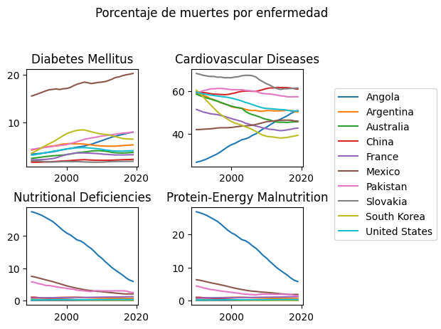

```python
import pandas as pd
import matplotlib.pyplot as plt
#Leemos los archivos iniciales

filesPath="C:\\Users\\carlo\\OneDrive\\Documentos\\Escuela\\DAI\\ProyectoFinalDai\\"
causes = pd.read_csv(filesPath+"cause_of_deaths.csv", encoding="utf-8").rename({"Country/Territory": "Entity"}, axis=1)
population = pd.read_csv(filesPath+"population.csv", encoding="utf-8")
```
## PROBLEMA 1

```python
print("\n----------     1     -----------\n")
#Copiamos la tabla de las causas

percentage = causes.copy()
#Dividimos la cantidad de muertes entre las muertes totales y multpilicamos por cien para calcular el porcentaje

percentage.iloc[:, 3:] = percentage.iloc[:,3:].div(causes.sum(axis=1, numeric_only=True), axis="index")*100
print("Tabla de porcentajes: \n", percentage)
print(" ")
```

    
    ----------     1     -----------
    
    Tabla de porcentajes: 
                Entity Code  Year  Meningitis  \
    0     Afghanistan  AFG  1990    1.439708   
    1     Afghanistan  AFG  1991    1.396418   
    2     Afghanistan  AFG  1992    1.446117   
    3     Afghanistan  AFG  1993    1.526411   
    4     Afghanistan  AFG  1994    1.538196   
    ...           ...  ...   ...         ...   
    6115     Zimbabwe  ZWE  2015    1.089368   
    6116     Zimbabwe  ZWE  2016    1.118275   
    6117     Zimbabwe  ZWE  2017    1.135904   
    6118     Zimbabwe  ZWE  2018    1.155158   
    6119     Zimbabwe  ZWE  2019    1.154836   
    
          Alzheimer's Disease and Other Dementias  Parkinson's Disease  \
    0                                    0.744193             0.247398   
    1                                    0.715208             0.235464   
    2                                    0.678945             0.220861   
    3                                    0.644328             0.208443   
    4                                    0.615380             0.198690   
    ...                                       ...                  ...   
    6115                                 0.570801             0.162762   
    6116                                 0.588687             0.168087   
    6117                                 0.607631             0.173498   
    6118                                 0.633345             0.180842   
    6119                                 0.646708             0.184774   
    
          Nutritional Deficiencies   Malaria  Drowning  Interpersonal Violence  \
    0                     1.391695  0.062016  0.913571                1.025600   
    1                     1.355495  0.118991  0.875752                1.259798   
    2                     1.426251  0.139645  0.884614                1.343282   
    3                     1.539981  0.058625  0.915738                1.405362   
    4                     1.565636  0.107221  0.919259                1.447744   
    ...                        ...       ...       ...                     ...   
    6115                  2.285476  1.906204  0.582914                0.985654   
    6116                  2.345537  1.573413  0.614782                1.030010   
    6117                  2.326269  1.646283  0.636417                1.060436   
    6118                  2.324655  1.663427  0.657245                1.112138   
    6119                  2.296928  1.647034  0.658654                1.142093   
    
          ...  Diabetes Mellitus  Chronic Kidney Disease  Poisonings  \
    0     ...           1.405699                2.473310    0.225392   
    1     ...           1.334718                2.344571    0.220984   
    2     ...           1.257976                2.206278    0.225536   
    3     ...           1.191491                2.096372    0.230699   
    4     ...           1.133702                1.998079    0.229179   
    ...   ...                ...                     ...         ...   
    6115  ...           2.404330                1.595821    0.288429   
    6116  ...           2.501343                1.657840    0.301635   
    6117  ...           2.577568                1.708524    0.309651   
    6118  ...           2.693509                1.784519    0.318664   
    6119  ...           2.755677                1.825437    0.322558   
    
          Protein-Energy Malnutrition  Road Injuries  \
    0                        1.369689       2.770054   
    1                        1.334089       2.815500   
    2                        1.404632       2.983383   
    3                        1.518269       3.083763   
    4                        1.543785       3.049459   
    ...                           ...            ...   
    6115                     2.263522       1.796434   
    6116                     2.323279       1.869675   
    6117                     2.304484       1.924034   
    6118                     2.302349       1.998821   
    6119                     2.273831       2.034103   
    
          Chronic Respiratory Diseases  \
    0                         3.964364   
    1                         3.808984   
    2                         3.636034   
    3                         3.498477   
    4                         3.386368   
    ...                            ...   
    6115                      2.082592   
    6116                      2.139842   
    6117                      2.192450   
    6118                      2.269685   
    6119                      2.302503   
    
          Cirrhosis and Other Chronic Liver Diseases  Digestive Diseases  \
    0                                       1.782463            3.337534   
    1                                       1.717506            3.223471   
    2                                       1.653540            3.117185   
    3                                       1.597520            3.022424   
    4                                       1.538196            2.916322   
    ...                                          ...                 ...   
    6115                                    1.480752            3.181044   
    6116                                    1.505872            3.272699   
    6117                                    1.561479            3.378147   
    6118                                    1.617221            3.486983   
    6119                                    1.644645            3.533797   
    
          Fire, Heat, and Hot Substances  Acute Hepatitis  
    0                           0.215389         1.990518  
    1                           0.209022         1.946674  
    2                           0.210344         1.942763  
    3                           0.214957         1.954696  
    4                           0.213427         1.939133  
    ...                              ...              ...  
    6115                        0.478444         0.110527  
    6116                        0.497352         0.112058  
    6117                        0.508823         0.112034  
    6118                        0.523406         0.110736  
    6119                        0.527242         0.108316  
    
    [6120 rows x 34 columns]
     
    
## PROBLEMA 2

```python
print("\n----------     2     -----------\n")
countryList = [
    "China",
    "United States",
    "Mexico",
    "Angola",
    "Argentina",
    "Pakistan",
    "Australia",
    "South Korea",
    "Slovakia",
    "France"
]
# Creamos un DataFrame con los años, sin repeticiones, como columnas

growth = pd.DataFrame(index=pd.unique(population["Year"]))
# Agrupamos y calculamos el crecimiento en cada país

for entity in countryList:
    growth[entity] = population[population["Entity"]==entity]["Population (historical estimates)"].values
#Calculamos los porcentajes de crecimiento en las columnas de los países

growth=growth.pct_change()*100
#Graficamos

growth.plot(title="Porcentaje de crecimiento por país")
#Cerramos gráfica

plt.show()
plt.close()
```

    
    ----------     2     -----------
    
    


    

    

## PROBLEMA 3

```python
print("\n----------     3     -----------\n")
colsList = [
    "Diabetes Mellitus",
    "Nutritional Deficiencies",
    "Cardiovascular Diseases",
    "Protein-Energy Malnutrition",
    "Drug Use Disorders",
    "Neoplasms"
]
#Iteramos sobre cada enfermedad asignada

for dis in colsList:
    #Creamos un Dataframe para guardar la info y graficat
    df = pd.DataFrame(index=pd.unique(percentage["Year"]))
    #Analizaremos esta enfermedad sobre cada país requerido
    for entity in countryList:
        #Obtenemos los valores de la enfemedad que queremos del DataFrame en que están guarados todos los porcentajes
        df[entity] = percentage[percentage["Entity"]==entity].loc[:,dis].values
    #Graficamos
    #El contador i nos sirve para saber en qué renglón y columna poner la subgráfica
    ax = df.plot(title="Porcentaje de muertes por: "+dis)
    #Cerramos gráfica
    plt.show()
    plt.close()
#Creamos dataframes en los que guardaremos los valores máximos por cada país

maxes = pd.DataFrame(index=colsList)
mins = pd.DataFrame(index=colsList)
proms = pd.DataFrame(index=colsList)
#Iteramos sobre país

for entity in countryList:
    #Obtenemos el dataframe de las enfermedades asignadas para este país
    df = percentage[percentage["Entity"]==entity].loc[:,colsList+["Year"]]
    #Obtenemos los valores del país
    maxes[entity] = df.max().iloc[:-1].values
    mins[entity] = df.min().iloc[:-1].values
    proms[entity] = df.mean().iloc[:-1].values
#Obtenemos los valores de todos los países

print("País con porcentajes máximos: \n", maxes.idxmax(axis=1))
print(" ")
print("País con porcentajes mínimos: \n", mins.idxmin(axis=1))
print(" ")
print("Promedios: \n", proms.mean(axis=1))
print(" ")
```

    
    ----------     3     -----------
    
    


    

    


    

    


    

    


    

    


    

    


    

    


    País con porcentajes máximos: 
     Diabetes Mellitus                     Mexico
    Nutritional Deficiencies              Angola
    Cardiovascular Diseases             Slovakia
    Protein-Energy Malnutrition           Angola
    Drug Use Disorders             United States
    Neoplasms                             France
    dtype: object
     
    País con porcentajes mínimos: 
     Diabetes Mellitus                  China
    Nutritional Deficiencies        Slovakia
    Cardiovascular Diseases           Angola
    Protein-Energy Malnutrition     Slovakia
    Drug Use Disorders             Argentina
    Neoplasms                         Angola
    dtype: object
     
    Promedios: 
     Diabetes Mellitus               2.942466
    Nutritional Deficiencies        0.920212
    Cardiovascular Diseases        30.377542
    Protein-Energy Malnutrition     0.826644
    Drug Use Disorders              0.242873
    Neoplasms                      21.561556
    dtype: float64
     
    
## PROBLEMA 4

```python
print("\n----------     4     -----------\n")
#Creamos un nuevo dataframe, guardamos datos de poblacion y solo los valores de entidad, código y año de tabla de causas
#Hacemos este inner join para evitar tener datos incompletos que afecten el resultado

populDeaths = pd.merge(population, causes.iloc[:,[0,1,2]], how="inner", on=["Entity", "Code", "Year"])
#Obtenemos la suma de la cantidad de muertes por año por país

populDeaths["Total Deaths"] = causes.iloc[:,3:].sum(axis=1, skipna=True)
#Calculamos el porcentaje de estas muertes respecto al estimado de población

populDeaths["Death Percentage"] = populDeaths["Total Deaths"]/populDeaths["Population (historical estimates)"]*100
#Creamos un data frame para graficar con el año como índice

deathPercentages=pd.DataFrame(index=pd.unique(populDeaths["Year"]))
#Iteramos sobre cada país asignado

for entity in countryList:
    #Obtenemos los valores del porcentaje de muertes y lo guardamos en una columna del data frame previamente definido
    deathPercentages[entity] = populDeaths[populDeaths["Entity"]==entity]["Death Percentage"].values
#Graficamos la colección de todos los países

deathPercentages.plot(title="Porcentaje de personas fallecidas")
#Cerramos gráfica

plt.show()
plt.close()
#Obtenemos posición de valores

idMax=populDeaths["Death Percentage"].idxmax()
idMin=populDeaths["Death Percentage"].idxmin()
#Obtenemos valores desde la posición

print("País con mayor porcentaje de muertes: ", populDeaths.iloc[idMax,0])
print("País con menor porcentaje de muertes: ", populDeaths.iloc[idMin,0])
```

    
    ----------     4     -----------
    
    


    

    


    País con mayor porcentaje de muertes:  Niue
    País con menor porcentaje de muertes:  North Korea
    
## PROBLEMA 5

```python
print("\n----------     5     -----------\n")
import matplotlib.pyplot as plt
colsList2 = [
    "Diabetes Mellitus",
    "Cardiovascular Diseases",
    "Nutritional Deficiencies",
    "Protein-Energy Malnutrition"
]
#Con matplotlib creamos una figura de 2 rengolnes y 2 columnas para subgráficas
#Además, especificamos el ratio de las colmnas y filas

fig, axes = plt.subplots(nrows=3, ncols=3,  width_ratios=[2,2,1], height_ratios=[1,20,20])
#Añadimos espacio entre las subgráficas

fig.tight_layout(pad=2)
fig.suptitle("Porcentaje de muertes por enfermedad")
#Iteramos sobre cada enfermedad sobre la que queremos graficar

i=2
for dis in colsList2:
    #Creamos un Dataframe para guardar la info y graficat
    df = pd.DataFrame(index=pd.unique(percentage["Year"]))
    #Analizaremos esta enfermedad sobre cada país requerido
    for entity in countryList:
        #Obtenemos los valores de la enfemedad que queremos del DataFrame en que están guarados todos los porcentajes
        df[entity] = percentage[percentage["Entity"]==entity].loc[:,dis].values
    #Graficamos
    #El contador i nos sirve para saber en qué renglón y columna poner la subgráfica
    ax = df.plot(title=dis, ax=axes[i//2,(i+2)%2], legend=False)
    i+=1
#Guardamos las etiquetas en una variable

han, lab = ax.get_legend_handles_labels()
#Ocultamos las gráficas de la última columna y de la primera fila

axes[0,0].set_visible(False)
axes[0,1].set_visible(False)
axes[0,2].set_visible(False)
axes[1,2].set_visible(False)
axes[2,2].set_visible(False)
#Ponemos en su lugar una leyenda

fig.legend(han, lab, loc="center right")
#Cerramos gráfica

plt.show()
plt.close()
```

    
    ----------     5     -----------
    
    


    

    

## PROBLEMA 6

```python
print("\n----------     6     -----------\n")
#Colores para la gráfica

colors = ['yellowgreen','red','lightskyblue','lightcoral','blue', 'darkgreen','yellow','grey','violet','magenta','cyan']
#Iteramos sobre la lista de países

for entity in countryList:
    #Creamos figura
    fig = plt.figure()
    #Obtenemos en un DataFrame la información de la cantidad de muertes por año
    #Sumamos todas y obtenemos las muertes totales por enfermedad
    df = causes[causes["Entity"] == entity].set_index("Year").loc[:, colsList].sum()
    #Graficamos
    #Ocultamos el texto al hacerlo blanco
    ax = df.plot.pie(title="Porcentaje de muesrtes por enfermedad 1990-2019: "+entity, colors=colors, textprops={'color':"w"})
    #Obtenemos la info de las etiquetas
    patches, texts = ax.get_legend_handles_labels()
    #Le damos formato a las etiquetas para que muestren enfermedad y porcentaje
    labels = ['{0} - {1:1.2f} %'.format(i,j) for i,j in zip(df.index.values, df.values/df.sum()*100)]
    #Enseñamos las etiquetas
    fig.legend(patches, labels, bbox_to_anchor=(-0.1, 1.),fontsize=8)
    #Obtenemos el nombre (id) de la enfermedad con máximo y mínimo porcentaje
    print("Enfermedad con mayor porcentaje de muertes en "+entity+": ", df.idxmax())
    print("Enfermedad con menor porcentaje de muertes en "+entity+": ", df.idxmin())
    print(" ")
    #Cerramos gráfica
    plt.show()
    plt.close()
```

    
    ----------     6     -----------
    
    Enfermedad con mayor porcentaje de muertes en China:  Cardiovascular Diseases
    Enfermedad con menor porcentaje de muertes en China:  Protein-Energy Malnutrition
     
    


    

    


    Enfermedad con mayor porcentaje de muertes en United States:  Cardiovascular Diseases
    Enfermedad con menor porcentaje de muertes en United States:  Protein-Energy Malnutrition
     
    


    

    


    Enfermedad con mayor porcentaje de muertes en Mexico:  Cardiovascular Diseases
    Enfermedad con menor porcentaje de muertes en Mexico:  Drug Use Disorders
     
    


    

    


    Enfermedad con mayor porcentaje de muertes en Angola:  Cardiovascular Diseases
    Enfermedad con menor porcentaje de muertes en Angola:  Drug Use Disorders
     
    


    

    


    Enfermedad con mayor porcentaje de muertes en Argentina:  Cardiovascular Diseases
    Enfermedad con menor porcentaje de muertes en Argentina:  Drug Use Disorders
     
    


    

    


    Enfermedad con mayor porcentaje de muertes en Pakistan:  Cardiovascular Diseases
    Enfermedad con menor porcentaje de muertes en Pakistan:  Drug Use Disorders
     
    


    

    


    Enfermedad con mayor porcentaje de muertes en Australia:  Cardiovascular Diseases
    Enfermedad con menor porcentaje de muertes en Australia:  Protein-Energy Malnutrition
     
    


    

    


    Enfermedad con mayor porcentaje de muertes en South Korea:  Neoplasms
    Enfermedad con menor porcentaje de muertes en South Korea:  Drug Use Disorders
     
    


    

    


    Enfermedad con mayor porcentaje de muertes en Slovakia:  Cardiovascular Diseases
    Enfermedad con menor porcentaje de muertes en Slovakia:  Protein-Energy Malnutrition
     
    


    

    


    Enfermedad con mayor porcentaje de muertes en France:  Neoplasms
    Enfermedad con menor porcentaje de muertes en France:  Drug Use Disorders
     
    


    

    

